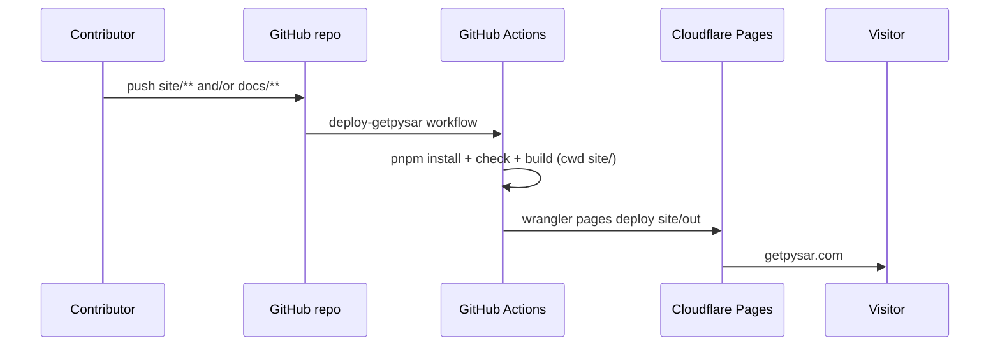

# Deploy pipeline — GitHub Actions → Cloudflare Pages

**Contributor-only. Not a public site page.** Under `site/engineering/` — never
route this file (or any peer here) into the static export.

Static generation (SSG via `output: 'export'`) and production deploy for
**getpysar.com**.

**Related:** [approach.md](./approach.md) · [human-setup.md](./human-setup.md)

---

## End-to-end flow



| Step | Owner |
|---|---|
| Motherhome + ingest code | `site/` |
| User docs prose | repo-root `docs/` |
| Static HTML | GitHub Actions (`pnpm build` in `site/`) |
| CDN / TLS / domain | Cloudflare Pages |

---

## Build output

```bash
cd site
pnpm build
# artifact: site/out/
```

`next.config.ts` must set:

```ts
const nextConfig = {
  output: "export",
  images: { unoptimized: true },
};
```

| Variable | Value | Purpose |
|---|---|---|
| `NEXT_PUBLIC_SITE_URL` | `https://getpysar.com` | Canonical URLs in metadata, sitemap, JSON-LD |

Set in the workflow `env` for the build step. Never bake `*.pages.dev` into production metadata.

---

## Cloudflare Pages (Direct Upload)

- Create an **empty** Pages project (Direct Upload). GitHub Actions uploads `out/`.
- **Do not** enable Cloudflare’s Next.js SSR / OpenNext adapter for MVP.
- Custom domain: `getpysar.com` (+ optional `www` with 301 to apex).
- Bulk Redirect: `*.pages.dev` → `https://getpysar.com` (preserve path + query).

---

## GitHub secrets

| Secret | Purpose |
|---|---|
| `CLOUDFLARE_API_TOKEN` | Pages Edit |
| `CLOUDFLARE_ACCOUNT_ID` | Account ID |
| `CLOUDFLARE_PROJECT_NAME` | e.g. `getpysar` |

---

## Workflow skeleton (target)

**File:** `.github/workflows/deploy-getpysar.yml`

```yaml
name: Deploy getpysar.com

on:
  push:
    branches: [master] # or main — match repo default
    paths:
      - "site/**"
      - "docs/**"
      - ".github/workflows/deploy-getpysar.yml"
  workflow_dispatch:

concurrency:
  group: deploy-getpysar
  cancel-in-progress: true

jobs:
  build-and-deploy:
    runs-on: ubuntu-latest
    permissions:
      contents: read
      deployments: write
    defaults:
      run:
        working-directory: site
    env:
      NEXT_PUBLIC_SITE_URL: https://getpysar.com
    steps:
      - uses: actions/checkout@v4

      - uses: pnpm/action-setup@v4

      - uses: actions/setup-node@v4
        with:
          node-version: "22"
          cache: "pnpm"
          cache-dependency-path: site/pnpm-lock.yaml

      - run: pnpm install --frozen-lockfile
      - run: pnpm check
      - run: pnpm build

      - name: Verify export output
        run: |
          test -d out
          test -f out/index.html
          test -f out/sitemap.xml
          test -f out/robots.txt

      - name: Deploy to Cloudflare Pages
        working-directory: site
        env:
          CLOUDFLARE_API_TOKEN: ${{ secrets.CLOUDFLARE_API_TOKEN }}
          CLOUDFLARE_ACCOUNT_ID: ${{ secrets.CLOUDFLARE_ACCOUNT_ID }}
          CLOUDFLARE_PROJECT_NAME: ${{ secrets.CLOUDFLARE_PROJECT_NAME }}
        run: |
          set -euo pipefail
          for var in CLOUDFLARE_API_TOKEN CLOUDFLARE_ACCOUNT_ID CLOUDFLARE_PROJECT_NAME; do
            if [ -z "${!var}" ]; then
              echo "::error title=Missing secret::Set ${var} in repo Settings → Secrets → Actions"
              exit 1
            fi
          done
          pnpm exec wrangler pages deploy out \
            --project-name="$CLOUDFLARE_PROJECT_NAME" \
            --branch=main \
            --commit-dirty=true
```

**Deploy note:** Use repo-local `wrangler` via `pnpm exec`, not `cloudflare/wrangler-action`. The action’s auto-install path has failed on modern pnpm layouts; shell deploy with an explicit secret check surfaces real errors.

**Pages `--branch=main`:** Cloudflare production environment label — independent of whether git default is `master` or `main`.

---

## Failure modes

| Symptom | Likely cause | Fix |
|---|---|---|
| Workflow skipped | Push only touched Go/internal | Expected; site workflow path-filtered |
| `out/` missing | `output: 'export'` missing / build error | Fix `next.config.ts`; read build log |
| Deploy 403 | Bad token / missing Pages Edit | Regenerate API token |
| Wrong canonicals | `NEXT_PUBLIC_SITE_URL` unset or wrong | Set workflow env to apex |
| Empty `/docs` | Ingest path wrong in CI | Confirm checkout includes repo-root `docs/` |
| Go release broken | Accidental edit to release workflow | Keep site workflow separate |

**Rollback:** Cloudflare Pages → Deployments → prior success → Rollback. Long-term: git revert + push.

---

## Local parity

```bash
cd site
pnpm install
NEXT_PUBLIC_SITE_URL=http://localhost:3000 pnpm dev
pnpm build
pnpm preview   # serve out/ (e.g. port 4321)
```
